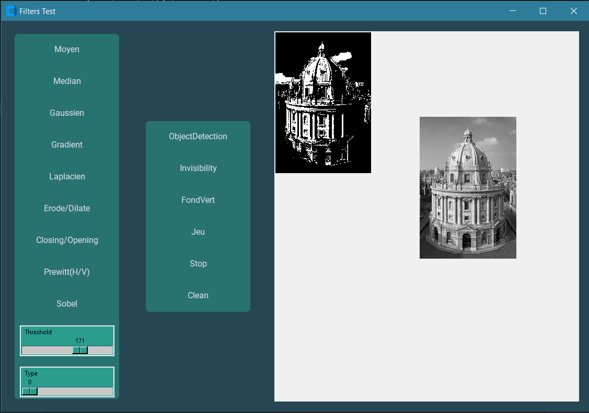
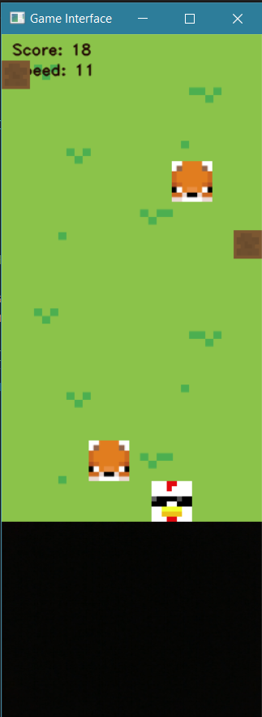
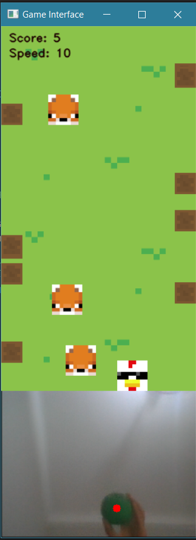
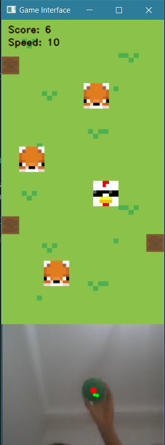

# Dodge game - Chicken Escape 🐔🦊

It is a computer vision based game where players guide a chicken 🐔 through obstacles 🌳 and dodge fox enemies 🦊 using real-time color detection. The character's movements are controlled by shifting the position of a green object detected by the camera. Aadding to that a Kalman Filter for predicting the position of the object when it's not on the screen anymore.

But before accessing the game, a menu is displayed containing various tools like image processing filters implemented without using predefined functions, as well as an "Invisibility Cloak" and a "Green Screen" using object color detection.

## Installation 🛠️

Prerequisite: found in `requirements.txt`

Run the file `python IHM.py`

## Usage/Examples 

This is the landing Page where we can select filters or play with the invisibility cloak and the green screen or access the game

  

 
- **Controls of the game part**:
    - Keyboard Controls:
        - "SPACE" bar: Start or restart the game.
        - By default the game is in mode 1 that works with keybord:
            - "Q": Move the character left.
            - "D": Move the character right.
        - "2": Mode 2 with color based detection that allows Horizontal movement.
        - "3": Mode 3 with color based detection that allows Horizontal and verical movement.
        - "E": Quit the game.
   

**Mode 1:**

  

**Mode 2:**

  

**Mode 3:**

  

## License 📜

[creativecommons](https://creativecommons.org/licenses/by-nc-sa/4.0/)
